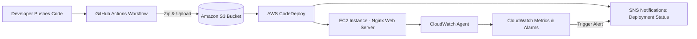

# MyWebApp

## Overview
This project demonstrates a **CI/CD pipeline** that auto-deploys a static web page to an **Amazon EC2 instance** running Nginx.  
Every push to the `main` branch in **GitHub** automatically triggers deployment through **GitHub Actions → S3 → CodeDeploy → EC2**.  

Additionally:  
- **SNS** sends **email notifications** on deployment success/failure.  
- **CloudWatch** monitors logs/metrics and can raise alarms.  

This setup highlights **end-to-end automation**, **monitoring**, and **notifications** in a real DevOps workflow.

---

## Architecture
- **Developer (GitHub push)** → Commits code to `main`.  
- **GitHub Actions** → Zips the code & uploads to an S3 bucket.  
- **S3 Bucket** → Temporary storage for deployment artifacts.  
- **AWS CodeDeploy** → Fetches artifact from S3 and deploys to EC2.  
- **EC2 Instance (Nginx)** → Hosts the live static website.  
- **SNS** → Notifies via email when deployments succeed/fail.  
- **CloudWatch** → Collects logs + monitors instance health.  

---
## Services Used
- **GitHub Actions** – CI/CD workflow runner.
- **Amazon S3** – Stores deployment artifacts.
- **AWS CodeDeploy** – Handles automated deployments.
- **Amazon EC2 (Nginx)** – Web server hosting the app.
- **Amazon SNS** – Sends email notifications for deployments.
- **Amazon CloudWatch** – Collects logs and monitors metrics.

--- 
## How It Works
1. Push changes to **main** in GitHub.
2. GitHub Actions workflow zips code → uploads to S3 → triggers CodeDeploy.
3. CodeDeploy executes lifecycle scripts (**before_install.sh**, **after_install.sh**, etc.).
4. Updated files are deployed to /usr/share/nginx/html on EC2.
5. SNS sends an email confirming deployment result.
6. CloudWatch captures logs/metrics (e.g., Nginx + CodeDeploy logs).
   
---

## Screenshots
- Check Screenshots Folder

---

## Future Scope
- Extend to multi-tier apps (frontend + backend).
- Use Elastic Load Balancer + Auto Scaling for high availability.
- Replace static HTML with containerized apps (ECS/EKS).
- Add security best practices (IAM roles, HTTPS via ACM, WAF).

   

